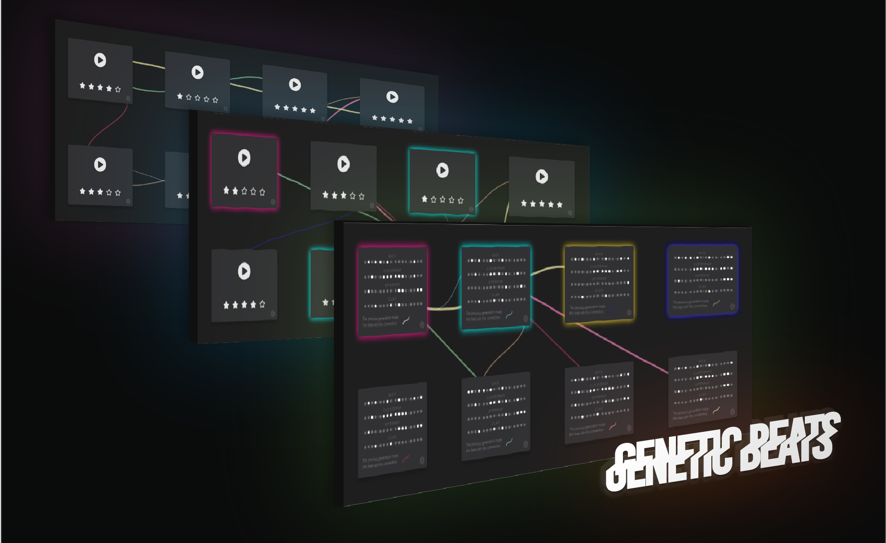

# genetic-beats
Genetic Beats is an application for artists, musicians and dj’s who want to create musical beats in a new way.

It’s made to be a creative tool that generates ideas to get inspiration from when making music. Under the hood is a genetic algorithm that improves the beats as the user votes for their favorites.

## Requirements
* Install the latest LTS version of [Node](https://nodejs.org/en/) on your computer.
* Install [Git](https://git-scm.com/book/en/v2/Getting-Started-Installing-Git) on your computer to be able to clone the repository.

## Installation
Open your computers terminal and clone this repository to your computer. Type:
```git clone https://github.com/fgrhlt/genetic-beats.git```

Move to the newly cloned repository
```cd genetic-beats```

Install node_modules that are needed to run the application:
```npm install```

Run the application
```npm start```

This will open the application in your browser on port 3000.

## Demo
A demo is located on [Heroku](https://genetic-beats.herokuapp.com/)

My portfolio is located [Issuu](https://issuu.com/asppp/docs/simonasp-portfolio2018)
